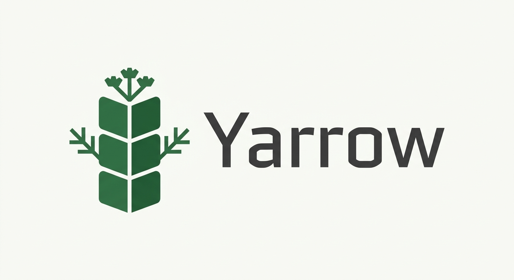

<p align="center">
  
</p>

<p align="center">
  <b>A typed stack-based language with ownership, regions, and explicit unsafe</b>
</p>

<p align="center">
  Safe by default · No lifetime annotations · Cranelift JIT
</p>

---

## Quick look

```yarrow
"std.io" io require

greet function
  string
do
  "Hello, " swap + io.write_line call
end

main function do
  "Yarrow!" greet call
end
```

Everything lives on a stack. Values are owned. Borrow creates safe references. Regions free whole groups of heap data at once. Raw pointers and manual memory stay behind an explicit unsafe boundary.

## Highlights

- **Stack-oriented**: postfix, explicit, and composable
- **Ownership + regions**: no user-visible lifetimes
- **Safe references** (`reference<T>`) vs **raw pointers** (`pointer<T>`)
- **Modules**: `"path" [scope] require`
- **Unsafe is visible**: `unsafe function` and `unsafe … end` never disable the borrow checker
- **Pure-Yarrow std**: growing standard library written in the language itself

## Status

Early but already usable. Tokenizer, parser, ownership model, unsafe enforcement, and the core of the pure-Yarrow standard library are in place. See `crates/**/PLAN.md` for the roadmaps and `docs/syntax.yar` for the full language tour.

## Build & run

```bash
cargo build --release
# Or
cargo run -- <file.yar>
```

## Learn more

- **Read the docs at** → [`README.md`](docs/README.md)
